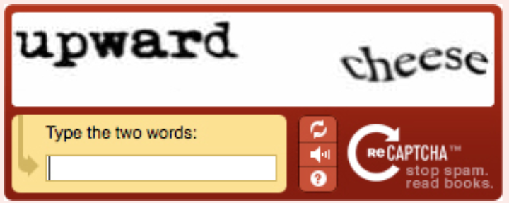

# APS360: CAPTCHA Bypass
### Team 99
* Nicholas Leung
* Coden Mercurius
* Pranavbhai Patel
* Ravi Singh

### Setup
1. Clone Git repository
> git clone git@github.com:natanleung/APS360-captcha-bypass.git
2. Generate `dataset.zip`
> $ pip install captcha

> $ python3 dataset_generator.py

> $ zip dataset.zip dataset/
3. Open `captcha.ipynb` in [Google Colab](https://colab.research.google.com/)
4. Upload `dataset.zip` into notebook (make sure to update any relevant cells to match the correct file name)
5. Upload `2Char.pth` and `3Char.pth` into notebook

### Description
CAPTCHA bypass is a deep learning solution to decode basic CAPTCHA images. The training datasets were generated using the Python `captcha` module. Included in the notebook are several models including:
* Primary CNN model
* Base SVM model
* AlexNet transfer learning model

Each model utilizes a character segmentation module using `OpenCV.findContours()` to segment the CAPTCHA image into five separate character images. The module supports two implementations, one leveraging deep-learning and one without it. 

Furthermore, the notebook contains results and training functionality used during development. Lastly, an end-to-end model is provided that takes in a single CAPTCHA image and outputs the decoded character string.

